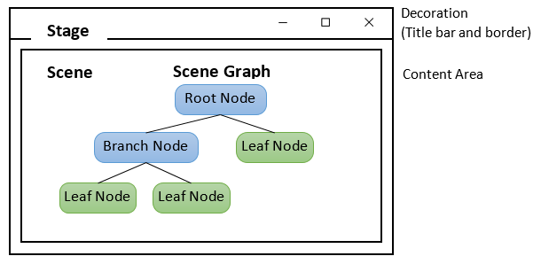

# CS165 Software Design Pattern
### 2020/01/20

## 0. Some problems and solutions
1. Display problem
Get linux warning: 
`Exception in thread "main" java.lang.reflect.InvocationTargetException`
`Caused by: java.lang.UnsupportedOperationException: Unable to open DISPLAY`

Solution:
`$ export DISPLAY=:0`


### 1. 2020/01/20 
Project: Factory and Observer

### 2. 2020/01/30
Project: Java AWT Examples

AWT (Abstract Windowing Toolkit) API was introduced in JDK 1.0. Most of the AWT 
components have become obsolete and should be replaced by newer Swing components.

JDK 1.0's AWT was awkward and non-object-oriented (using many `event.getSource()`). 
JDK 1.1's AWT introduced event-delegation (event-driven) model, much clearer and 
object-oriented.

### 3. 2020/01/31
Project: Java Swing Examples

Swing API, a much more comprehensive set of graphics libraries that enhances the 
AWT, was introduced as part of Java Foundation Classes (JFC) after the release of 
JDK 1.1. JFC consists of Swing, Java2D, Accessibility, Internationalization, and 
Pluggable Look-and-Feel Support APIs. JFC has been integrated into core Java 
since JDK 1.2.

Swing application uses AWT event-handling classes (in package java.awt.event). 
Swing added some new classes in package javax.swing.event, but they are not frequently used.
Swing application uses AWT's layout manager (such as FlowLayout and BorderLayout 
in package java.awt). It added new layout managers, such as Springs, Struts, and 
BoxLayout (in package javax.swing).

**As a rule, do not mix heavyweight AWT components and lightweight Swing components in the same program, as the heavyweight components will always be painted on top of the lightweight components.**

Just like AWT application, a Swing application requires **a top-level container**. There are three top-level containers in Swing:

1. JFrame: used for the application's main window (with an icon, a title, minimize/maximize/close buttons, an optional menu-bar, and a content-pane), as illustrated.
2. JDialog: used for secondary pop-up window (with a title, a close button, and a content-pane).
3. JApplet: used for the applet's display-area (content-pane) inside a browser’s window.

Similarly to AWT, there are **secondary containers** (such as JPanel) which can be used to group and layout relevant components.

**However**, unlike AWT, the JComponents shall not be added onto the top-level container (e.g., JFrame, JApplet) directly because they are lightweight components. The JComponents must be added onto the so-called **content-pane** of the top-level container. **Content-pane** is in fact a java.awt.Container that can be used to group and layout components.

### 4. Running the GUI Construction Codes on the Event-Dispatching Thread
Invoking the constructor directly in the entry main() method to setup the GUI components, will be executed in the so-called "Main-Program" thread. This may cause multi-threading issues (such as unresponsive user-interface and deadlock).

It is recommended to execute the GUI setup codes in the so-called "Event-Dispatching" thread, instead of "Main-Program" thread, for thread-safe operations. Event-dispatching thread, which processes events, should be used when the codes updates the GUI.

To run the constructor on the event-dispatching thread, invoke * static * method `SwingUtilities.invokeLater()` to **asynchronously queue** the constructor on the event-dispatching thread. The codes will be run after all pending events have been processed.

**Note**: `javax.swing.SwingUtilities.invokeLater()` is a cover for `java.awt.EventQueue.invokeLater()`

### 5. JavaFX set up
1. Download javaFX sdk [here](https://openjfx.io/), and extract anywhere you want. Either somewhere as public library or `lib` folder inside your project. I did later one.
2. Open your project using vscode, open `.classpath` file at the root of project. Add these below:
```
	<classpathentry kind="lib" path="lib/javafx-swt.jar"/>
	<classpathentry kind="lib" path="lib/javafx.base.jar"/>
	<classpathentry kind="lib" path="lib/javafx.controls.jar"/>
	<classpathentry kind="lib" path="lib/javafx.fxml.jar"/>
	<classpathentry kind="lib" path="lib/javafx.graphics.jar"/>
	<classpathentry kind="lib" path="lib/javafx.media.jar"/>
	<classpathentry kind="lib" path="lib/javafx.swing.jar"/>
	<classpathentry kind="lib" path="lib/javafx.web.jar"/>
```
**Note:** Since in step 1, I extract sdk into project, so the path is `lib` folder inside project. You need change path, if you extract to different path.
**If `.classpath` file is invisible, open `.vscode/settings.json`, change `"**/.classpath": false,` to `"**/.classpath": true,`.**
3. Open `.vscode/launch.json`, in `configurations`, there are 1-3 settings, find the one with `"name":"Debug (Launch) - Current File"`, add a new line:

	`"vmArgs": "--module-path ./lib/ --add-modules javafx.controls,javafx.fxml",`

This is setting for java virtual machine. ** Note: ** `./lib` is the path where sdk locates, change it as where you extracted it.

### 6. JavaFX introduction
1. A JavaFX GUI Program extends from javafx.application.Application
2. JavaFX provides a huge set of controls (or components) in package `javafx.scene.control`, including `Label`, `Button` and `TextField`.
3. JavaFX comonents hierarchical diagram:



3.1. Details of components
`Application` (with **abstract** function `start()`, your class must to **override** it) -> 
`Stage` (argument of `start()` of `Application`, has `setTitle()`, `show()`, `setScene()`) -> 
`Scene` (argument of `setScene()` of `Stage`), has constructor taking `Pane` as *Root Node*: `new Scene(panel, width, height)` ) -> 
`Pane` (argment of `new Scene()`, has `getChildren()` which returns a list  of `Node`. Pane is **Root Node**, other leaf nodes can be added, also **layout** is set here by choosing different types of pane) -> 
`Components` (added by `Panel.getChildren().add()`)

3.2. `Application` and its Life Cycle
A JavaFX application extends from javafx.application.Application. The JavaFX runtime maintains an Application's life cycle as follows:

    1. It constructs an instance of Application.
    2. It calls the Application's `init()` method.
    3. It calls the Application's `start(javafx.stage.Stage)` method, and passes the primary stage as its argument.
    4. It waits for the Application to complete (e.g., via `Platform.exit()`, or closing all the windows).
    5. It calls the Application's `stop()` method.

3.3. `Stage`
JavaFX uses the metaphor of a theater to model the graphics application. A stage (defined by the javafx.stage.Stage class) represents the **top-level container**, typically a window. The UI elements such as controls (or components) are contained in a scene (defined by the javafx.scene.Scene class). An application can have more than one scenes, but only one of the scenes can be displayed on the stage at any given time.

A stage is divided into decoration (title bar and border) and the content area. A stage can have one of these styles:

    StageStyle.DECORATED: solid white background with decorations
    StageStyle.UNDECORATED: solid white background with no decorations
    StageStyle.TRANSPARENT: transparent background with no decorations
    StageStyle.UTILITY: solid white background with minimal decorations

A primary stage is created by the **JavaFX runtime**, and passed into the Application as an argument in the Application's start() method.

4. To start an Application (a class implements Application), call static method: `Appliaction.launch(arg)`;

### 7. 2020/02/15 
Project: JQZip Single File Compressor
